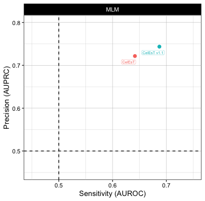

# CelEsT-app
Shiny app for performing TF activity estimation in C. elegans with the CelEsT Gene Regulatory Network (Perez 2024 Genetics, [doi:10.1093/genetics/iyae189](https://academic.oup.com/genetics/advance-article/doi/10.1093/genetics/iyae189/7929675)) and the decoupleR package

Download the repository (click on the drop down arrow on the green 'Code' button and select 'Download ZIP'), unzip it and run the app.R file from within R using the runApp() function in the 'shiny' package or by opening the file and using the 'Run App' button within 'R Studio'.

The first time the app runs on the local machine it should install all necessary packages. This may take a few minutes.

If you use CelEsT in a publication, don't forget to cite:

*Perez, MF (2024) CelEsT: a unified gene regulatory network for estimating transcription factor activity in C. elegans. Genetics doi: 10.1093/genetics/iyae189*

& 

*Badia-i-Mompel, P et al. (2022) decoupleR: ensemble of computational methods to infer biological activities from omics data. Bioinformatics Advances, doi: 10.1093/bioadv/vbac016*

If you use this app for DE analysis, cite:

*Love, MI et al. (2014) Moderated estimation of fold change and dispersion for RNA-seq data with DESeq2. Genome Biology, doi: 10.1186/s13059-014-0550-8*

If you choose to control for developmental age in your analysis, cite:

*Bulteau, R & Francesconi, M. (2022) Real age prediction from the transcriptome with RAPToR. Nature Methods, doi: 10.1038/s41592-022-01450-0*

**UPDATES:**

**2024-10-27**: 

1) Functionality added to choose alternative networks.

**2025-02-20**

1) Bug fix causing errors running DE analysis + TF activity analysis from counts (including with sample data)
2) Added CelEsT v1.1 network, with the same 487 TFs as the core network as reported in Perez 2024 (Genetics) but with significantly better performance. This was achieved by building the network as for CelEsT but ordering targets by conservation probability of the known in vitro binding motif or the de novo motif as reported for orthCelEsT. In compiling this network, TF-target conservation probabilities were NOT adjusted for multiple corrections, allowing for ordering of many more relevant targets with some conservation signal, thus boosting performance.

**MESSAGES:**

**2025-01-27**

N.B. ERRORS INSTALLING GITHUB PACKAGES ON SOME OPERATING SYSTEMS

Some users have reported problems installing the Github packages LBMC/RAPToR and LBMC/wormRef on first use of the app. This may be because of Github personal access tokens (PAT) stored locally - the error message may mention 'bad credentials'.

In this case, I recommend that users install and load the 'gitcreds' package from CRAN (run code "install.packages('gitcreds')" and load with "library('gitcreds')". 

Run these lines to check for tokens:

Sys.getenv("GITHUB_TOKEN")
Sys.getenv("GITHUB_PAT")
gitcreds::gitcreds_get()
gitcreds::gitcreds_get()$password

Then remove them with this function:

gitcreds::gitcreds_delete()

The Github packages should now install without further problems.

 
